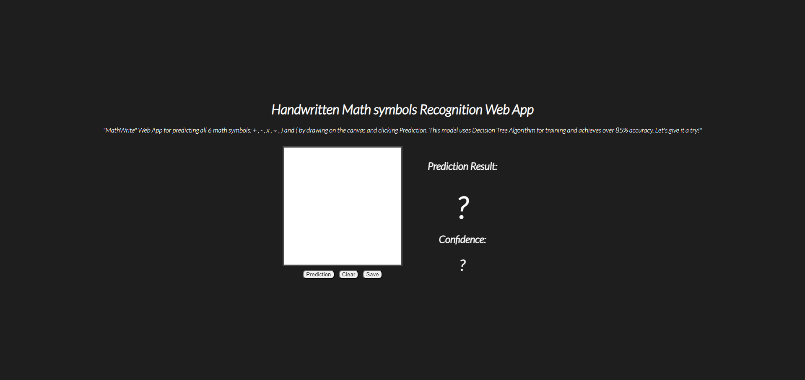
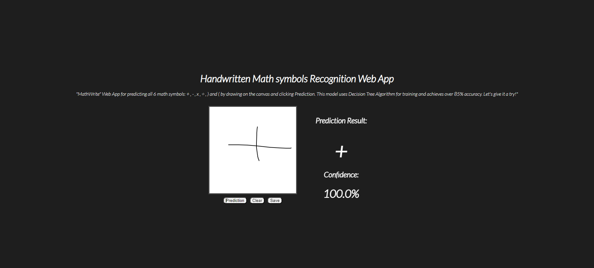

# MathWrite

## How to run this project  

**run command following**
1.open terminal or cmd  
2.git clone https://github.com/aongxsss/MathWrite.git  
3.pip install -r requirements.txt  
4.python app.py  

# Notes

In this project, the decision tree algorithm is used, which is not very accurate. You can take the dataset in the images folder and train a new model. You may use Deep learning, CNN, etc. to increase the accuracy. 
This project is just part of my homework. 
Thanks!

# Samples

